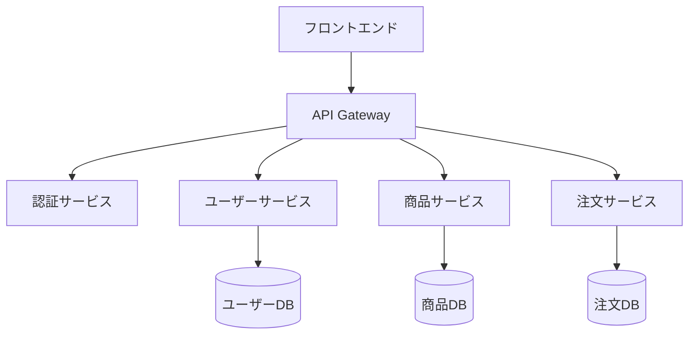
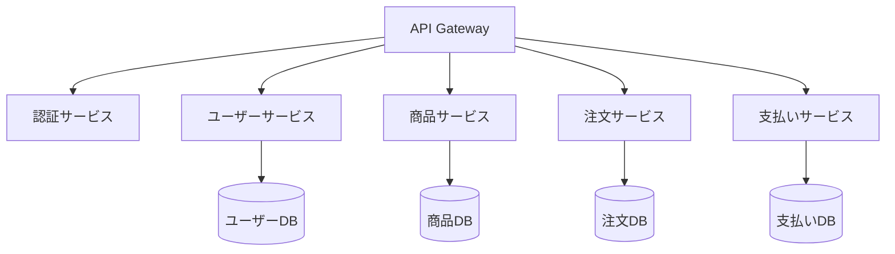

# アーキテクチャ決定記録（ADR）ガイドライン

## 目次

- [概要](#概要)
- [ADRの目的と価値](#adrの目的と価値)
- [ADRの基本構造](#adrの基本構造)
- [ADRのライフサイクル](#adrのライフサイクル)
- [ADRの管理と組織化](#adrの管理と組織化)
- [ADRテンプレート](#adrテンプレート)
- [ADR作成のベストプラクティス](#adr作成のベストプラクティス)
- [ツールとインテグレーション](#ツールとインテグレーション)
- [ADRの例](#adrの例)

## 概要

アーキテクチャ決定記録（Architecture Decision Record、ADR）は、ソフトウェアプロジェクトにおける重要なアーキテクチャ上の決定を文書化するための軽量な方法です。ADRは、決定の背景、検討された選択肢、選ばれた選択肢とその理由、そして予想される結果を記録します。

このドキュメントは、プロジェクトでADRを効果的に導入し活用するためのガイドラインを提供します。

## ADRの目的と価値

### 主な目的

- **意思決定の透明性**: 重要な決定がなぜ、どのように行われたかを明確にする
- **知識の保存**: チームメンバーの入れ替わりがあっても、決定の背景知識を失わない
- **コミュニケーションの促進**: 決定事項を明確に伝え、共通理解を形成する
- **将来の意思決定の支援**: 過去の決定を参照して、一貫性のある新たな決定を行う
- **変更の追跡**: 時間の経過とともに決定がどのように変化したかを追跡する

### ステークホルダー別の価値

- **アーキテクト/技術リード**: 決定の根拠を明確に伝え、一貫したアーキテクチャビジョンを維持できる
- **開発者**: システムの設計意図を理解し、それに沿った実装を行える
- **新しいチームメンバー**: プロジェクトの重要な決定とその背景を迅速に理解できる
- **プロジェクトマネージャー**: 技術的な決定の影響とリスクを把握できる
- **将来のメンテナー**: システムがなぜ特定の方法で設計されたかを理解できる

## ADRの基本構造

### 標準的な構成要素

1. **タイトル**: ADRの内容を簡潔に表す識別子と名前
2. **ステータス**: 提案、承認、廃止、置換などの状態
3. **コンテキスト**: 決定が必要となった背景、問題、制約条件
4. **決定**: 選択されたオプションと採用理由の明確な説明
5. **代替案**: 検討された他のオプションとそれらが選ばれなかった理由
6. **結果**: 決定の結果として予想される影響（ポジティブ、ネガティブ、中立）
7. **関連する決定**: 関連するADRへの参照

### 追加可能な要素

- **参加者**: 決定に関与した人々
- **日付**: 決定が行われた日付
- **遵守事項**: 決定に従うために必要なアクション
- **注釈**: 後から追加された補足情報
- **参考資料**: 決定に影響を与えた外部資料

## ADRのライフサイクル

### 1. 作成

1. アーキテクチャ上の重要な決定が必要な状況を特定する
2. 問題、制約条件、要件を明確に定義する
3. 可能な選択肢を特定し、それぞれの長所と短所を評価する
4. ADRテンプレートを使用して初期ドラフトを作成する
5. 決定案とその根拠を明確に文書化する

### 2. レビューと承認

1. 関連するステークホルダーとADRドラフトを共有する
2. フィードバックを収集し、必要に応じてADRを改訂する
3. 合意に達したら、ADRのステータスを「承認済み」に更新する
4. 承認されたADRをリポジトリにコミットする

### 3. 実装と参照

1. 承認されたADRに基づいて実装を進める
2. 実装中に発見された新たな情報や課題をADRに反映する
3. コードレビューやアーキテクチャレビューでADRを参照する
4. 新しい決定を行う際に、関連する既存のADRを参照する

### 4. 維持と更新

1. 定期的にADRの妥当性をレビューする
2. 状況の変化により決定が無効になった場合、ADRのステータスを「廃止」に更新する
3. 決定が別の決定に置き換えられた場合、ADRのステータスを「置換」に更新し、新しいADRへの参照を追加する
4. 必要に応じてADRに注釈や補足情報を追加する

## ADRの管理と組織化

### ディレクトリ構造

```
docs/
└── architecture/
    ├── adr/
    │   ├── README.md                # ADRの概要と索引
    │   ├── 0001-record-architecture-decisions.md
    │   ├── 0002-use-postgresql-database.md
    │   ├── 0003-adopt-microservices-architecture.md
    │   └── ...
    ├── diagrams/                    # アーキテクチャ図
    └── principles.md                # アーキテクチャ原則
```

### 命名規則

- 連番プレフィックス + ハイフン + 簡潔な名前
- 例: `0001-record-architecture-decisions.md`
- 連番は、決定の時系列順を示し、参照を容易にする

### 索引の維持

README.mdファイルに、すべてのADRの一覧と簡単な説明を含める：

```markdown
# アーキテクチャ決定記録（ADR）

このディレクトリには、プロジェクトのアーキテクチャ決定記録が含まれています。

## 索引

* [ADR-0001](0001-record-architecture-decisions.md) - アーキテクチャ決定を記録する
* [ADR-0002](0002-use-postgresql-database.md) - PostgreSQLデータベースを使用する
* [ADR-0003](0003-adopt-microservices-architecture.md) - マイクロサービスアーキテクチャを採用する
```

### バージョン管理

- ADRはソースコードと同じリポジトリで管理し、同じバージョン管理システムを使用する
- ADRの変更は、通常のコード変更と同様にレビューとマージのプロセスを経る
- 承認されたADRの内容を変更する場合は、新しいADRを作成して古いADRを置き換える

## ADRテンプレート

### 基本テンプレート

```markdown
# ADR-NNNN: タイトル

## ステータス

[提案 | 承認 | 廃止 | 置換] YYYY-MM-DD

## コンテキスト

この決定が必要となった背景、問題、制約条件について説明します。
ビジネス要件、技術的な制約、チームの状況など、決定に影響を与える要因を記述します。

## 決定

選択されたオプションと採用理由を明確に説明します。
「我々は X を選択する。なぜなら Y だからである。」という形式で記述することが有効です。

## 代替案

検討された他のオプションとそれらが選ばれなかった理由を説明します。
各代替案の長所と短所、および選択されなかった具体的な理由を記述します。

## 結果

この決定の結果として予想される影響を説明します。
ポジティブな結果、ネガティブな結果、中立的な結果を含めます。
短期的な影響と長期的な影響の両方を考慮します。

## 関連する決定

関連するADRへの参照を記述します。
例: [ADR-0002](0002-use-postgresql-database.md)
```

### 拡張テンプレート

```markdown
# ADR-NNNN: タイトル

## ステータス

[提案 | 承認 | 廃止 | 置換] YYYY-MM-DD

## 参加者

- 名前 (役割)
- 名前 (役割)

## コンテキスト

この決定が必要となった背景、問題、制約条件について説明します。

### 問題の詳細

問題の詳細な説明。

### 制約条件

考慮すべき制約条件のリスト。

## 決定

選択されたオプションと採用理由を明確に説明します。

### 技術的詳細

決定の技術的な詳細や実装方針。

## 代替案

### 代替案1: [名前]

説明と評価。

### 代替案2: [名前]

説明と評価。

## 結果

### ポジティブな結果

- 項目1
- 項目2

### ネガティブな結果

- 項目1
- 項目2

### 中立的な結果

- 項目1
- 項目2

## 遵守事項

この決定に従うために必要なアクション。

## 関連する決定

関連するADRへの参照。

## 参考資料

- [リンク1](URL) - 説明
- [リンク2](URL) - 説明
```

## ADR作成のベストプラクティス

### 内容に関するベストプラクティス

1. **簡潔かつ明確に**: ADRは短く、焦点を絞ったものにする（通常2〜3ページ以内）
2. **一つの決定に集中**: 各ADRは単一の重要な決定に焦点を当てる
3. **コンテキストを十分に説明**: 将来の読者が当時の状況を理解できるようにする
4. **技術的な詳細と根拠のバランス**: 技術的な詳細と決定の根拠の両方を含める
5. **客観的な評価**: 代替案を公平に評価し、選択の根拠を明確にする
6. **結果を予測**: 決定の短期的・長期的な影響を予測する
7. **関連する決定への参照**: 関連するADRへの参照を含め、決定間の関係を明確にする

### プロセスに関するベストプラクティス

1. **早期に開始**: プロジェクトの初期段階からADRを導入する
2. **協調的なアプローチ**: 決定プロセスに関連するステークホルダーを巻き込む
3. **レビュープロセスの確立**: ADRのレビューと承認のための明確なプロセスを確立する
4. **継続的な更新**: プロジェクトの進行に伴いADRを更新し、最新の状態を維持する
5. **アクセシビリティの確保**: ADRを簡単に検索・参照できるようにする
6. **コードとの整合性**: 実装がADRに沿っていることを確認するためのレビューを行う
7. **定期的な振り返り**: 定期的にADRの有効性と価値をレビューし、プロセスを改善する

## ツールとインテグレーション

### ADR管理ツール

- [adr-tools](https://github.com/npryce/adr-tools): ADRの作成と管理を支援するコマンドラインツール
- [Log4brains](https://github.com/thomvaill/log4brains): ADRのためのドキュメント生成ツール
- [ADR Manager](https://adr.github.io/adr-manager/): ADRの作成と管理のためのWebベースのツール

### 開発ワークフローとの統合

- **プルリクエスト**: 新しいADRや既存ADRの更新をプルリクエストを通じてレビューする
- **CI/CD**: ADRのフォーマットや参照の整合性を検証する自動チェックを組み込む
- **ドキュメント生成**: ADRからプロジェクトドキュメントを自動生成する
- **トレーサビリティ**: 要件、ADR、コード、テスト間のトレーサビリティを確保する

### Mermaidとの統合

ADRにMermaidを使用して図表を含めることで、決定の視覚的な理解を促進します：

```markdown
## 決定

マイクロサービスアーキテクチャを採用し、以下のサービス分割を行います：


```

## ADRの例

### 例1: データベース選択

```markdown
# ADR-0002: PostgreSQLデータベースの採用

## ステータス

承認 2023-04-15

## コンテキスト

プロジェクトでは、以下の要件を満たすデータベースが必要です：

- リレーショナルデータモデルのサポート
- 高い信頼性とデータ整合性
- 複雑なクエリとトランザクションのサポート
- オープンソースであること（コスト削減のため）
- 開発チームの既存のスキルセットとの互換性

## 決定

PostgreSQLをプロジェクトのプライマリデータベースとして採用します。

理由：
- 強力なリレーショナル機能と高度なデータ型をサポート
- 優れたデータ整合性と信頼性
- 活発なコミュニティとエコシステム
- チームの大部分がPostgreSQLの経験を持っている
- クラウドプロバイダー（AWS、GCP、Azure）での良好なサポート

## 代替案

### MySQL/MariaDB

- 長所: 広く使用されている、軽量、多くのホスティングオプション
- 短所: 一部の高度なSQL機能の欠如、トランザクション処理がPostgreSQLほど強力でない
- 不採用理由: 複雑なクエリとデータ整合性の要件に対してPostgreSQLの方が適している

### MongoDB

- 長所: スケーラビリティ、柔軟なスキーマ
- 短所: リレーショナルデータに対する制約、チームの経験不足
- 不採用理由: プロジェクトのデータモデルは主にリレーショナルであり、NoSQLの利点が限定的

### Oracle Database

- 長所: 企業レベルの機能、高い信頼性
- 短所: 高コスト、オープンソースでない
- 不採用理由: コスト制約とオープンソース要件

## 結果

### ポジティブな結果

- 強力なデータ整合性と信頼性の確保
- 複雑なクエリとデータ操作のサポート
- チームの既存のスキルセットの活用
- オープンソースによるコスト削減

### ネガティブな結果

- 非常に大規模なデータセットに対しては、水平スケーリングが課題となる可能性がある
- NoSQLデータベースと比較して、スキーマの柔軟性が低い

### 中立的な結果

- クラウドプロバイダーのマネージドサービスを利用する場合、追加のコストが発生する
- 将来的にシャーディングが必要になる可能性がある

## 関連する決定

- [ADR-0003](0003-database-migration-strategy.md): データベース移行戦略
```

### 例2: アーキテクチャパターン選択

```markdown
# ADR-0003: マイクロサービスアーキテクチャの採用

## ステータス

承認 2023-05-10

## コンテキスト

現在のモノリシックアプリケーションは以下の課題に直面しています：

- スケーラビリティの制限
- 開発速度の低下
- 複数チームによる並行開発の困難さ
- デプロイの複雑さと頻度の制限

ビジネス要件として、以下が求められています：

- 迅速な機能追加と更新
- 高い可用性とスケーラビリティ
- 複数の開発チームによる並行開発
- 独立したコンポーネントの段階的なデプロイ

## 決定

マイクロサービスアーキテクチャを採用し、現在のモノリシックアプリケーションを段階的に分割します。

サービスの分割は以下の原則に基づいて行います：

1. ビジネスドメインに基づく境界
2. データの所有権の明確化
3. 独立したデプロイと運用
4. チームの責任範囲との整合性

初期のサービス分割は以下の通りです：



## 代替案

### モノリシックアーキテクチャの改善

- 長所: 既存のコードベースを維持、シンプルな運用
- 短所: スケーラビリティの制限、開発の柔軟性の制限
- 不採用理由: 長期的なスケーラビリティと開発速度の要件を満たせない

### モジュラーモノリス

- 長所: モノリスの単純さとマイクロサービスの一部の利点を組み合わせる
- 短所: 完全な独立デプロイができない、スケーリングが粒度の細かいレベルでできない
- 不採用理由: 独立したデプロイとスケーリングの要件を完全には満たせない

### サーバーレスアーキテクチャ

- 長所: 高いスケーラビリティ、運用オーバーヘッドの削減
- 短所: 複雑な状態管理、コールドスタートの問題、ベンダーロックイン
- 不採用理由: 既存のスキルセットとの不一致、一部のユースケースに対する制約

## 結果

### ポジティブな結果

- 独立したサービスの並行開発と独立デプロイが可能になる
- 各サービスを個別にスケールできるようになる
- チームの自律性と責任の明確化
- 技術スタックの柔軟な選択

### ネガティブな結果

- 分散システムの複雑さの増加
- サービス間通信のオーバーヘッド
- 一貫したモニタリングとトラブルシューティングの課題
- 運用の複雑さの増加

### 中立的な結果

- マイクロサービスの管理のためのインフラストラクチャ投資が必要
- チームのスキルセットの拡大が必要
- サービスメッシュなどの追加技術の導入検討

## 遵守事項

- サービス間の明確なAPIの定義と文書化
- 分散トランザクション管理のためのパターン（Saga等）の採用
- 包括的なモニタリングとロギングの実装
- CI/CDパイプラインの強化

## 関連する決定

- [ADR-0004](0004-api-gateway-selection.md): APIゲートウェイの選択
- [ADR-0005](0005-service-discovery.md): サービスディスカバリの実装
- [ADR-0006](0006-data-consistency.md): データ一貫性の確保
